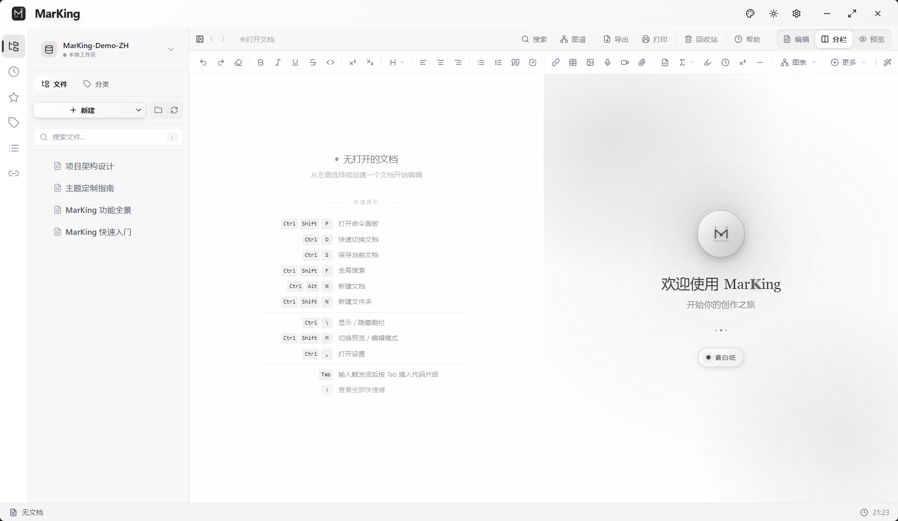
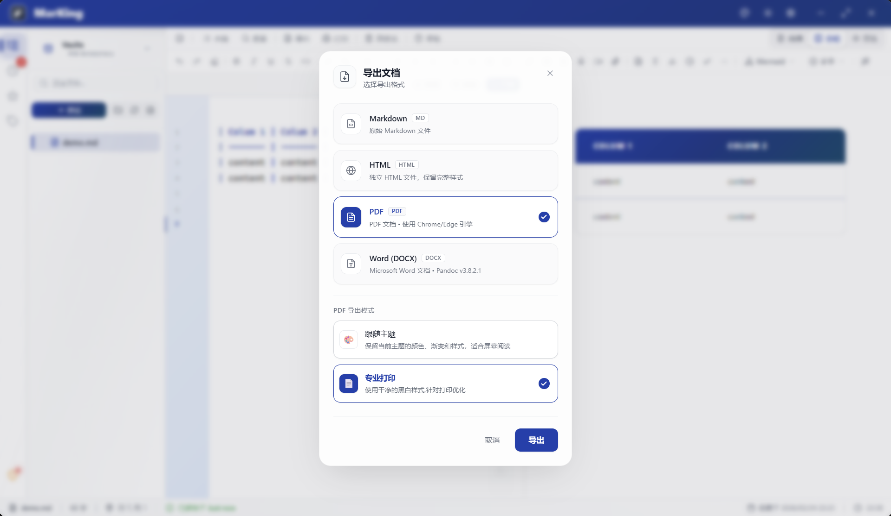

# MarKing - 专业 Markdown 编辑器

[English](./README_EN.md) | 简体中文

**Be the King of Markdown** 👑

**致力于打造极致纯粹的跨平台 Markdown 创作环境。**

凭借内置的 **可视化表格编辑引擎** 与 **高保真排版导出（DOCX/PDF）** 能力，完美填补技术探索与商务交付之间的缝隙，带给您原生 IDE 般的流畅敲击快感。

[⬇️ 下载安装](#-下载) • [✨ 核心功能](#-核心功能) • [📖 使用文档](docs/FAQ.md) • [🔄 更新日志](CHANGELOG.md) • [💬 社区反馈](https://github.com/l06066hb/MarKing/issues)

---

## 📸 应用预览

---

## 📥 下载

> 💡 **系统要求**：Windows 10 (64-bit) 或更高版本

### 🪟 Windows (推荐)

获取最新稳定版，享受开箱即用的原生级编辑体验。

- 📦 **[下载 Windows 稳定版 (MSI & EXE) ➔](https://github.com/l06066hb/MarKing/releases/latest)** 
  - 提供 `MSI 安装器` (支持静默安装与企业部署)
  - 提供标准 `Setup.exe 安装向导` (包含完整系统集成与资源管理器右键菜单)

> 💡 *提示：前往 Release 页面后，请展开 "Assets" 列表下载适合您系统的安装包。*

### macOS（即将推出）

macOS 版本正在测试中，敬请期待。

### Linux（即将推出）

Linux 版本正在测试中，敬请期待。

---

## ✨ 核心功能

### 💎 桌面原生级极简美学

- **原生级无边沉浸体验** - 12px完美边缘过渡，告别多余外框，犹如原生应用般浑然天成
- **18种精妙主题** - 搭配精心调配的深色/浅色核心预置主题，带来顶级视觉享受
- **高密度极简微缩排版** - 拒绝松散，视图间距极其紧凑，对标原生 IDE 的专业感
- **克制的物理级微交互** - 透明度悬停与毛玻璃背景完美交融，让每次点击清脆悦目

### 📝 专业编辑体验

- **Monaco内核强力驱动** - 顶级性能加持，流畅编辑数万字超大文档
- **实时同步预览** - 所见即所得的高颜值渲染，精准的双向滚动跟随
- **全场景智能补全** - 超 70 种核心文档块快捷补全，让思考不被打扰
- **全能一键排版** - 瞬间治愈强迫症的快捷键格式化，规范所有基础语法

### 🎯 创新功能

- **表格可视化编辑器** - 革命性体验，像 Excel 一样编辑 Markdown 表格
  - 光标移入表格自动显示编辑器
  - 实时双向同步
  - 添加/删除行列、设置对齐
  - 完整快捷键支持（Tab/Enter/Esc）

  *可视化表格操作演示：*
  

- **智能粘贴** - 简化工作流程，提升效率
  - 截图粘贴：Ctrl+V 自动保存并插入
  - 文件粘贴：复制图片文件后自动处理
  - 文本粘贴：智能规范化处理

- **列表自动续行** - 告别手动输入列表符号
  - 支持有序列表、无序列表、任务列表
  - 自动递增序号、保持缩进
  - 空列表项按 Enter 自动退出

### 📦 强大导出

- **DOCX 专业模板** `(当前功能 Beta 内测中，敬请期待)` - 10+ 配置项，满足各种文档需求
  - 3 个精心设计的预设模板（技术文档、商务报告、通用模板）
  - 无限自定义模板
  - 封面、目录、页眉页脚完整支持
  - 字体、间距、样式精细控制

  *所见即所得的专业 PDF 与 DOCX 导出：*
  

- **PDF 高质量输出** - 基于 Pandoc 引擎，专业级输出质量
- **HTML 静态页面** - 完整样式保留，可直接在浏览器打开

### 🎨 美观易用

- **18 种精妙主题** - 从护眼素雅到极客赛博，总有一款完美适配你的桌面风格
  - Classic Midnight、Cool Black、Sepia Yellow、Eye Care、GitHub Style、Dracula Night
  - Indigo Purple、Ocean Blue、Forest Green、Rose Pink、Sunset Orange、Monochrome
  - Neon Cyber、Coral Reef、Lavender Dream、Warm Autumn、Cool Winter、Soft Midnight
  
- **亮色/暗色模式** - 全局主题切换，护眼舒适
- **现代化 UI** - Material Design 风格，流畅的交互动画
- **优雅滚动条** - 细腻流畅的交互体验

### 🗄️ 智能管理

- **多库支持** - 独立管理不同项目，数据库按库隔离
- **全局搜索** - Rust 并行处理，高性能全文检索，毫秒级响应
- **自动保存** - 2 秒防抖，编辑后自动保存，永不丢失数据
- **版本快照** - 自动保存最近 10 个版本，随时恢复历史
- **数据备份** - 一键备份恢复，ZIP 压缩节省空间

### 🌍 国际化支持

- **完整双语界面** - 中文/English 一键切换，覆盖所有功能模块
- **类型安全翻译** - TypeScript 类型检查，确保翻译准确
- **实时切换** - 语言切换无需重启，即时生效

---

## 🎯 适用场景

| 场景 | 应用 |
|------|------|
| **技术文档** | API 文档、开发手册、技术博客 |
| **学术写作** | 论文、报告、笔记（支持数学公式 KaTeX） |
| **项目管理** | 需求文档、设计文档、会议记录 |
| **知识管理** | 个人笔记、知识库、学习资料 |
| **内容创作** | 博客文章、教程、电子书 |

---

## 🚀 快速开始

### 1. 安装应用
下载对应平台的安装包，按照向导完成安装

### 2. 创建文档
点击工具栏 `+` 按钮或按 `Ctrl+N` 创建新文档

### 3. 开始编辑
- 左侧编辑器输入 Markdown
- 右侧实时预览效果
- 使用代码片段快速插入常用内容

### 4. 导出文档
点击工具栏"导出"按钮，选择格式（DOCX/PDF/HTML）

> 📚 **更多使用技巧**：查看 [常见问题](docs/FAQ.md) 和 [故障排除](docs/TROUBLESHOOTING.md)

---

## 💡 为什么选择 MarKing？

### ⚡ 性能卓越
- 启动时间 < 0.5 秒
- 安装包约 40MB（已包含完整 Pandoc）
- 运行内存约 30-40MB

### 🎨 体验优秀
- 现代化界面设计
- 流畅的交互动画
- 完善的快捷键支持（按 `?` 查看所有快捷键）

### 🔒 数据安全
- 本地存储，保护隐私
- 自动保存，防止丢失
- 版本快照，随时恢复
- 数据备份，安心使用
- 完整日志记录，便于问题排查

---

## 常用快捷键

| 操作 | Windows/Linux | macOS |
|------|---------------|-------|
| 新建文档 | `Ctrl+N` | `Cmd+N` |
| 保存文档 | `Ctrl+S` | `Cmd+S` |
| 全局搜索 | `Ctrl+F` | `Cmd+F` |
| 格式化文档 | `Shift+Alt+F` | `Shift+Option+F` |
| 表格编辑器 | `Ctrl+Shift+T` | `Cmd+Shift+T` |
| 快捷键帮助 | `?` | `?` |

> 完整快捷键列表：在应用中按 `?` 键查看

---

## 📄 版权声明

Copyright © 2024-2026 MarKing. All rights reserved.

本软件为专有软件，受版权法和国际条约保护。未经授权，不得复制、修改、分发或反向工程。

详见 [LICENSE](LICENSE) 文件。

### 声明

MarKing 为本软件的名称。未经授权，不得用于商业用途或暗示官方背书。

---

## 🔗 相关链接

- 📥 [下载安装](https://github.com/l06066hb/MarKing/releases) - 获取最新版本
- 🌐 [官方网站](https://markingmd.com) - 在线体验和文档
- 📝 [更新日志](CHANGELOG.md) - 查看版本历史
- 📚 [常见问题](docs/FAQ.md) - 使用技巧和问题解答
- 🔧 [故障排除](docs/TROUBLESHOOTING.md) - 解决常见问题

---

## 📞 获取帮助

我们提供多种支持渠道，帮助您解决使用中的问题：

- 🐛 **问题反馈** - [GitHub Issues](https://github.com/l06066hb/MarKing/issues)
  - Bug 报告：[提交 Bug](https://github.com/l06066hb/MarKing/issues/new?template=bug_report.md)
  - 功能建议：[提交建议](https://github.com/l06066hb/MarKing/issues/new?template=feature_request.md)
  
- 💬 **讨论交流** - [GitHub Discussions](https://github.com/l06066hb/MarKing/discussions)
  - 使用问题咨询
  - 经验分享交流
  
- 🔒 **安全问题** - 请查看 [SECURITY.md](SECURITY.md)

- 📖 **使用文档**
  - [常见问题解答](docs/FAQ.md)
  - [故障排除指南](docs/TROUBLESHOOTING.md)

---

## 💎 可持续发展与赞助 (Backers)

如果您认可 MarKing 的产品哲学，并希望它能保持长期的纯净无广告体验以及持续的迭代，考虑成为我们的 Backer 吧！

您的每一份支持都将作为“基石”，直接用于维持基础服务器/官网开销、代码签名证书以及核心底层引擎的研发。

- ⚡ **[爱发电 (Afdian.net) ➔](https://afdian.com/a/l06066hb)** - 国内用户推荐（支持微信/支付宝）
- 🌍 **[Ko-fi ➔](https://ko-fi.com/l06066hb)** - 国际用户推荐（支持 Visa/PayPal）

> 💡 *在浩瀚的开源世界里存活不易，感谢每一份为信仰充值的力量！如果你觉得项目不错，也请在右上角点亮 ⭐️ Star，这是对独立开发者最大的肯定。*

---

**Be the King of Markdown!** 👑✍️

MarKing v1.1.0 | 让文档创作更高效

[⬆️ 回到顶部](#marKing---专业-markdown-编辑器)

