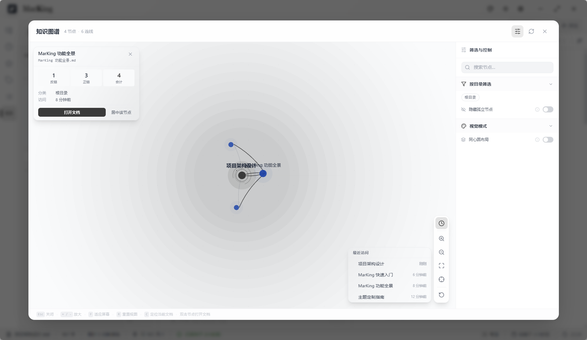
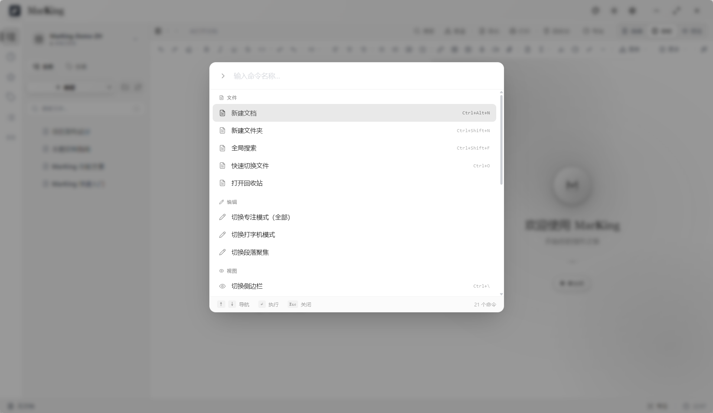
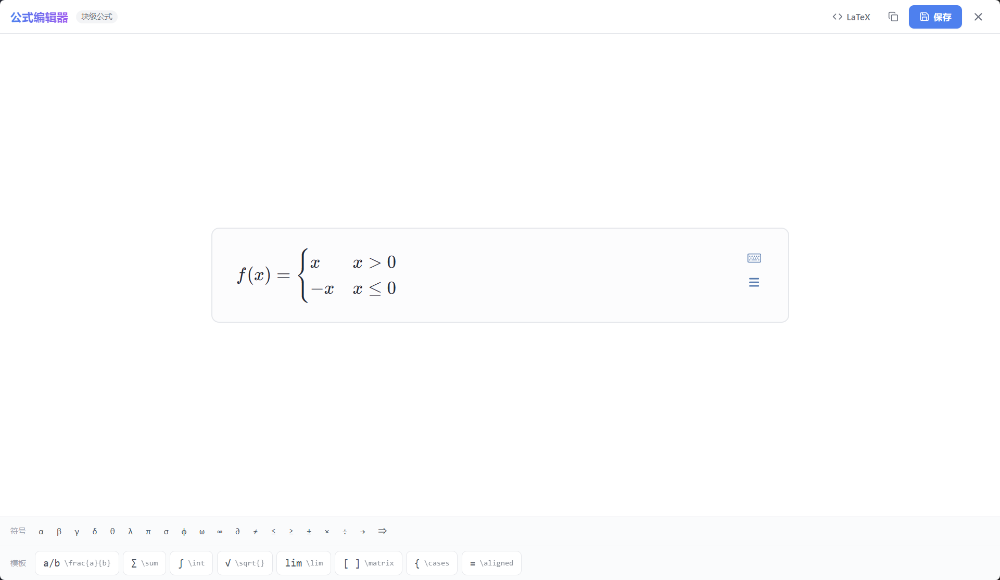
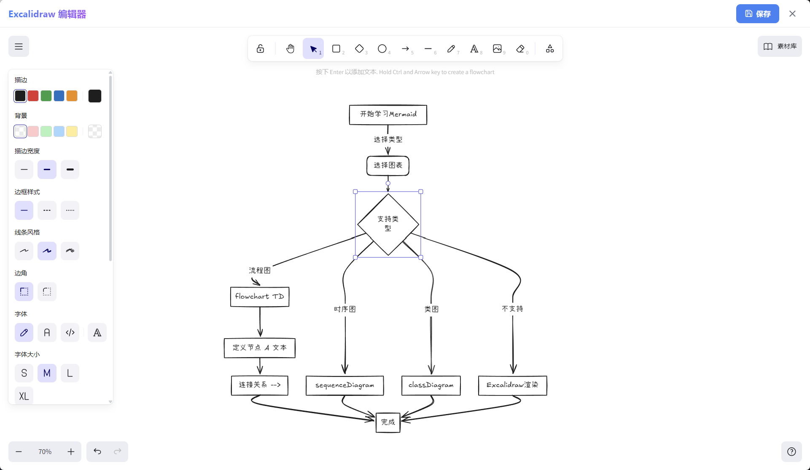
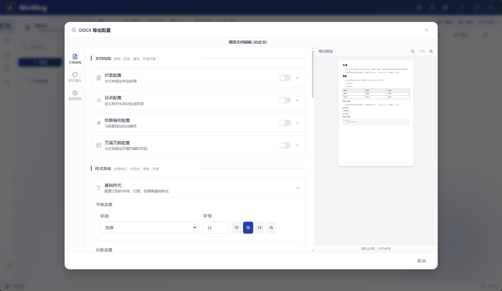

# MarKing

**本地优先 · 零追踪 · 跨平台 — 为严肃写作者打造的 Markdown 编辑器**

[English](./README_EN.md) | 简体中文

 

`剪贴板快捷捕获` · `附件管理器` · `文档属性面板` · `WikiLink 双链` · `知识图谱` · `命令面板` · `专注模式` · `MathLive 公式` · `Excalidraw 白板` · `DOCX/PDF/HTML 导出`

 

MarKing 是一款追求原生性能与极致稳定性的桌面端 Markdown 编辑器。  
**本地优先、零追踪、无广告** — 你的文字只属于你自己。

> **v1.3.3 稳定性修复**：修复 v1.3.2 反馈的编辑器显示与输入体验问题，文档打开速度回归原有水平。所有 v1.3.2 用户建议升级。

 

---

## 下载安装

提供开箱即用的桌面客户端，所有平台均为原生编译，无需额外运行时。

| 平台 | 架构 | 安装包 |
|:---:|:---:|:---:|
| **Windows** | x64 | [EXE / MSI](https://github.com/l06066hb/MarKing/releases/latest) |
| **macOS** | Apple Silicon / Intel | [DMG](https://github.com/l06066hb/MarKing/releases/latest) |
| **Linux** | x64 / ARM64 | [AppImage / Deb / RPM](https://github.com/l06066hb/MarKing/releases/latest) |

> 前往 [Releases](https://github.com/l06066hb/MarKing/releases/latest) 页面的 **Assets** 列表获取对应平台的最新安装包。

---

## 为什么选择 MarKing？

- **真正的本地优先** — 文件以纯 `.md` 明文存储在你的硬盘上，无云端锁定、无私有格式、无数据追踪
- **原生性能** — 原生编译，启动 < 2 秒，十万字长文流畅滚动
- **知识管理** — WikiLink 双链 + 交互式知识图谱，让笔记从孤岛变为网络
- **沉浸写作** — 专注模式、命令面板、面包屑导航，打造无干扰的写作环境
- **专业内容** — MathLive 公式、Excalidraw 白板、Mermaid 图表，一站式技术写作
- **一键导出** — DOCX 模板引擎 v2.0 / PDF / HTML，学术论文到商务报告通吃
- **全平台** — Windows · macOS (Intel & Apple Silicon) · Linux，同一套体验

---

## 核心功能

### 1. 性能优先的双模式架构

*   **极速轻量模式**  
    专为快速阅读和轻度编辑打造。去除侧边栏等额外组件后，双击任意 `.md` 文件即可以极低内存占用瞬间打开。

    

*   **全功能专业编辑器**  
    支持十万字以上的超大型文件流畅滚动。内置 70+ 种 Markdown 智能代码片段与上下文提示，专业级编辑体验。

    

### 2. 知识管理与效率

*   **双链系统与知识图谱** `NEW`  
    完整的 `[[WikiLink]]` 双向链接系统，搭配交互式知识图谱可视化。支持力导向布局、缩放漫游、万级节点流畅交互、图谱导出（PNG/SVG）与全屏沉浸。

    

*   **命令面板与快捷切换器** `NEW`  
    `Ctrl+Shift+P` 唤出命令面板搜索一切操作；`Ctrl+P` 快捷切换器毫秒级模糊搜索文件跳转。编辑区顶部面包屑导航实时显示路径层级。

    

*   **专注模式** `NEW`  
    打字机模式（光标行始终居中）+ 聚焦模式（淡化非当前段落），一键进入沉浸式无干扰写作。

*   **Callout 提示框** `NEW`  
    兼容 GitHub Alerts 与 Obsidian 语法，支持 `> [!NOTE]`、`> [!WARNING]` 等多类型提示块的实时渲染。

### 3. 创作与交互

*   **MathLive 公式编辑器**  
    集成可视化数学公式编辑器，支持行内与块级公式的所见即所得编辑。内置虚拟数学键盘，完全离线渲染，无需手写 LaTeX。

    

*   **Excalidraw 手绘白板** `NEW`  
    在文档中嵌入自由绘制的流程图、架构草图与示意图。以手绘风格激发创意表达，让技术文档不再枯燥。

    

*   **可视化表格编辑器**  
    在应用内悬浮编辑 Markdown 表格，彻底告别字符对齐的烦恼。支持类似 Excel 的行列拖拽、增删及内容对齐。

    

*   **Mermaid 图表助手**  
    内置专业的 Mermaid 绘图渲染支持。流程图、时序图、架构图均可通过助手系统实时预检与可视化渲染。

    

*   **双域主题与代码块高亮**  
    12px 无边框沉浸界面。全局深浅色主题之外，独立内置多套经典代码块预设主题（Dracula、Nord、Tokyo Night 等），极致代码高亮体验。

    

### 4. 安全可靠的本地数据

*   **本地多库管理 (Multi-Vault)**  
    在应用内物理隔离不同文档库。个人日记与工作文档完全独立存放，零检索干扰。

    

*   **自动防抖保存与历史快照**  
    2 秒静默自动保存 + 历史快照回溯，防止误操作或断电丢失数据。

    

*   **剪贴板图片本地转存**  
    `Ctrl+V` 粘贴截图即自动保存至本地附件目录，并转为正确的相对引用链接。

### 5. 专业文档导出

*   **DOCX 模板化导出引擎 v2.0** `NEW`  
    全新模板化配置架构，支持实时排版预览、精细字体与间距控制。内置多套专业排版模板，一键生成含封面页、目录、页眉页脚的正式汇报文档。

    

*   **PDF 与 HTML 导出**  
    导出含书签目录的高质量 PDF，或将文档及排版导出为独立 HTML 页面以便离线分享。

    

---

##  文档

*   [常见问题解答 (FAQ)](docs/FAQ.md)
*   [特性更新与版本历史](CHANGELOG.md)
*   [安全提报与策略须知](SECURITY.md)

---

## 支持项目

**如果 MarKing 对你的写作有所帮助，请点亮一颗 Star**

这是对独立开发者最直接、最有力的鼓励，也能让更多人发现这款工具。

### 赞助

维持一款纯本地化、零追踪、无广告的跨平台独立软件持续迭代并不容易。  
如果你认可 MarKing 的品质，欢迎成为早期赞助者：

*   **国内** — [爱发电](https://afdian.com/a/l06066hb) (微信 / 支付宝)
*   **国际** — [Ko-fi](https://ko-fi.com/l06066hb) (Visa / PayPal)

---

*Copyright © 2025-2026 MarKing. All rights reserved.*
