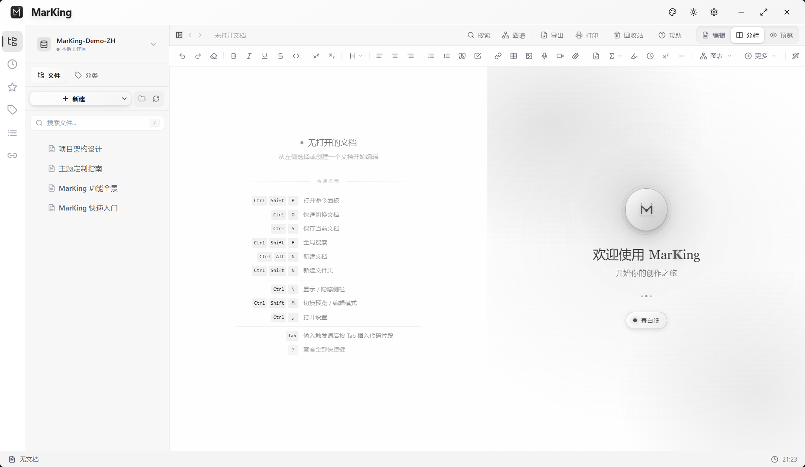
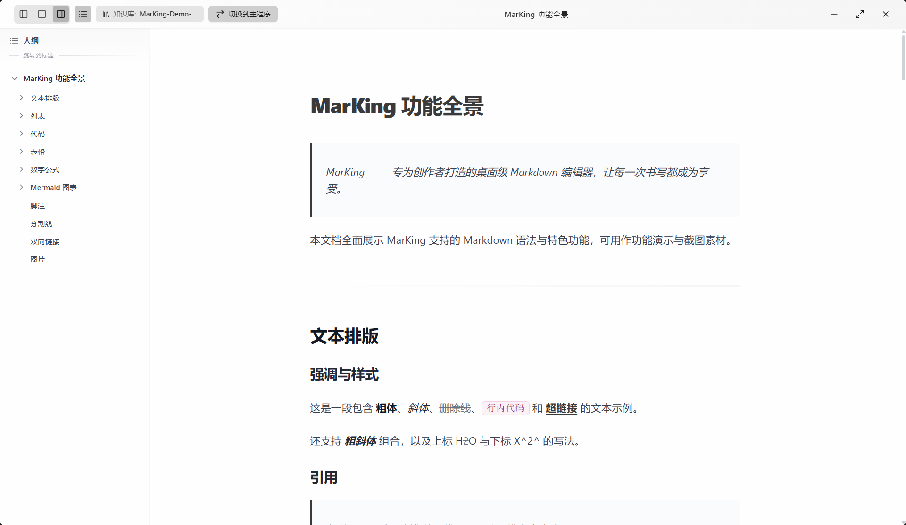
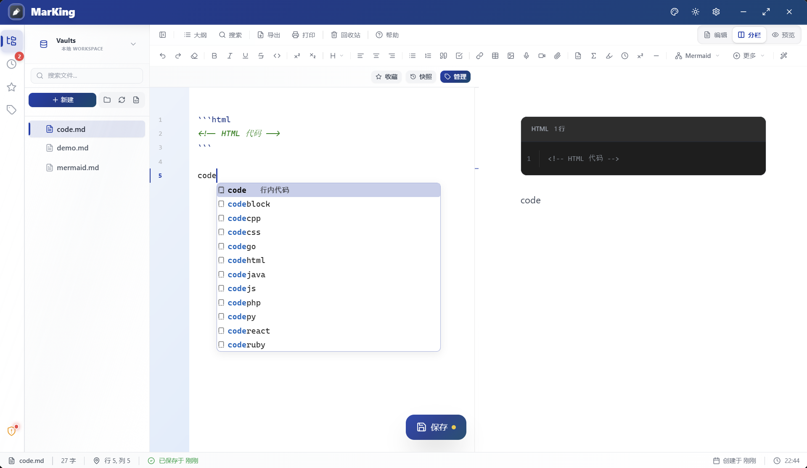
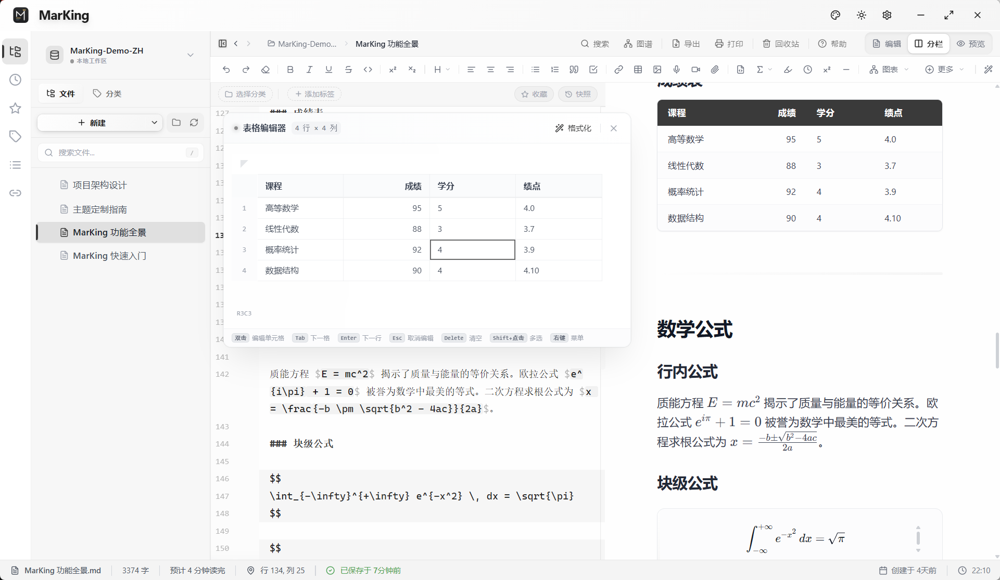
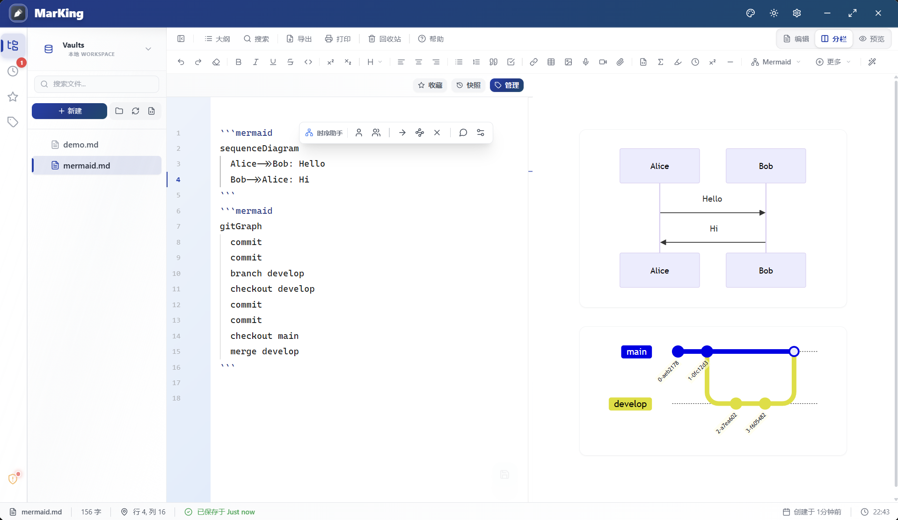
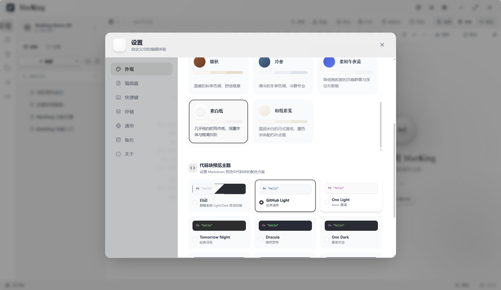
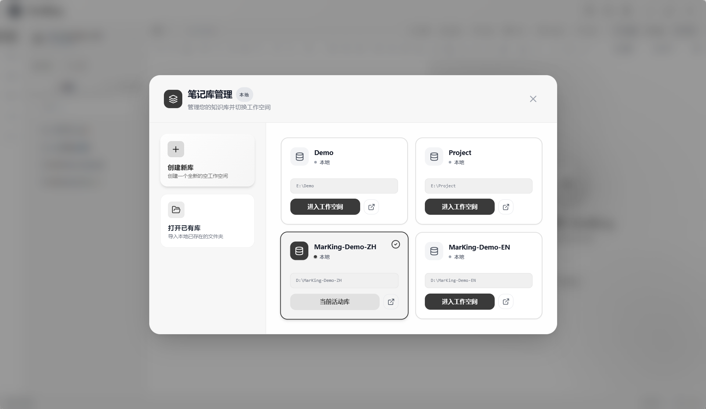
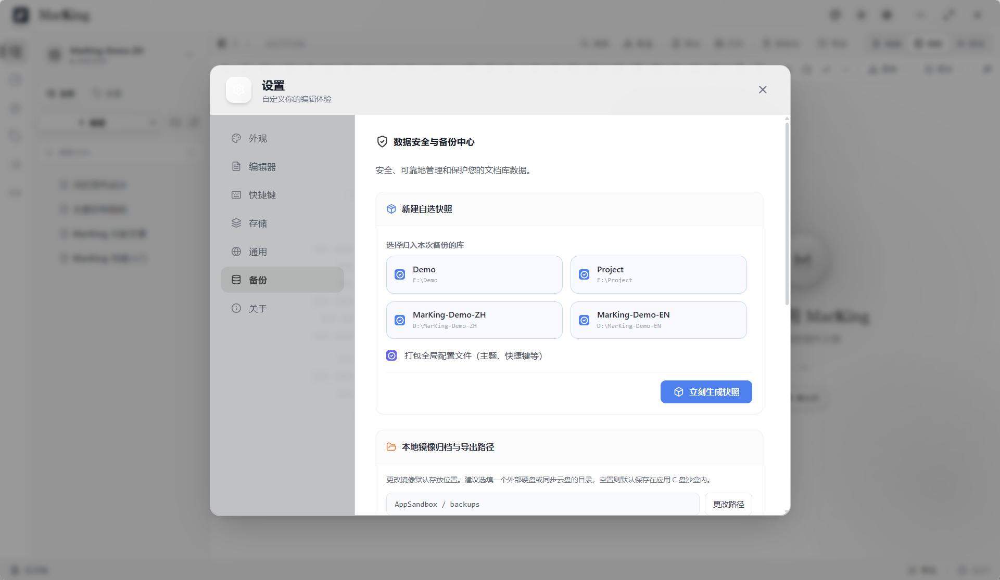
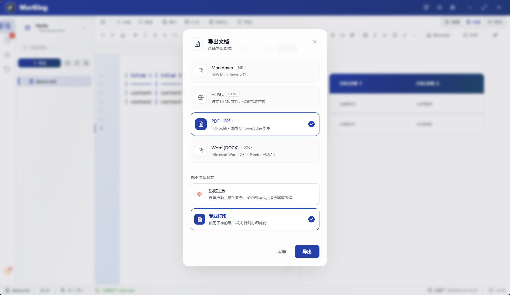

# MarKing

**干净、极速的跨平台 Markdown 编辑器**

[English](./README_EN.md) | 简体中文

 

 

MarKing 是一款致力于原生性能和稳定性的桌面端 Markdown 编辑器。系统当前主打本地优先与极致响应，在提供顺滑编辑体验的同时，也为未来即将引入的多端同步功能奠定了坚实的底层基础。

 

---

## 下载安装

提供开箱即用的桌面客户端。

**Windows** (仅支持 64-bit)
- [下载 EXE 与 MSI 安装包](https://github.com/l06066hb/MarKing/releases/latest) - 支持系统环境变量与右键菜单集成

**macOS** (支持 Apple Silicon & Intel)
- [下载 DMG 安装包](https://github.com/l06066hb/MarKing/releases/latest) - 已针对 M 系列芯片进行原生性能支持

**Linux**
- [下载 AppImage / Deb / RPM / Tar.gz](https://github.com/l06066hb/MarKing/releases/latest) - 提供多种免环境依赖的构建版本

> **注**：请前往 Release 页面的 `Assets` 列表获取对应平台的最新安装包。

---

## 核心功能

### 1. 性能优先的两种模式

*   **极速轻量模式**
    专为只读浏览和轻度修改打造。由于去除了侧边栏等额外组件，默认双击 MD 文件将实现极低物理内存占用的瞬间秒开。
    

*   **全功能专业编辑器**
    编辑器底层基于定制化的 Monaco Core 引擎，支持高达十万字以上的超大型文件流畅滚动。内置了 70 多种常用的 Markdown 智能代码片段与提示。
    

### 2. 流畅直觉的文档交互

*   **可视化表格编辑器**
    在应用内悬浮编辑 Markdown 表格，彻底告别字符对齐的烦恼。支持类似 Excel 的直接拖拽行列、增加删减和内容对齐。
    

*   **Mermaid 图表与公式支持**
    内置专业的绘图与渲染支持。无论是流程图、架构图还是数学公式 (KaTeX)，助手系统都能提供实时的预检与可视化渲染。
    

*   **双域主题与代码块高亮**
    12px 的无边框界面设计。除了支持全局深浅色主题切换外，还独立内置了多套经典的代码块预设主题（如 Dracula、Nord、Tokyo Night 等），为您提供极致的代码高亮体验。
    

### 3. 安全可靠的本地数据管理

*   **本地多库管理 (Multi-Vault)**
    在应用内部分离不同的本地文档库。你可以将个人的日记与工作文档彻底分开存放，各库之间完全独立，不会产生任何检索干扰。
    

*   **自动防抖与历史快照**
    防止因误操作或断电造成文档丢失。编辑器会在 2 秒内静默自动保存进度，同时提供历史快照功能保留并追溯每次重大修改的节点版本。
    

*   **剪贴板图片本地转存**
    对剪贴板操作提供深度支持：在编辑器中通过 `Ctrl+V` 粘贴截图，软件将自动保存图片至本地附件目录，并自动转为正确的相对引用链接。

### 4. 完整的文档导出系统

*   **全功能工业标准导出**
    支持导出含有清晰书签目录的高质量 PDF，也可以直接将文档及其排版导出为独立的 HTML 页面，以便直接离线分享。

*   **DOCX 模板化导出引擎** (Beta)
    彻底打破 MD 转 Word 的排版难题。系统内置多套精心设计的排版模板，由编辑器为您全自动导出拥有正规封面页与目录格式的汇报类文档。未来将开放对自定义模板的导入支持。
    

---

## 帮助文档

如需解决使用上的问题，请参考我们附带的官方常见文档与支持资源：

*   [常见问题解答 (FAQ)](docs/FAQ.md)
*   [特性更新与版本历史](CHANGELOG.md)
*   [安全提报与策略须知](SECURITY.md)

---

## 支持独立开发

维持一款纯本地化、无追踪插件、无广告的跨平台独立软件运转并不容易。如果您认可当前的软件质量，并十分期待后续即将加入真正的跨端同步功能，请考虑成为项目的早期赞助者：

*   **国内赞助渠道**: [爱发电专属页面](https://afdian.com/a/l06066hb) (微信 / 支付宝)
*   **国际赞助渠道**: [Ko-fi Support](https://ko-fi.com/l06066hb) (Visa / PayPal)

> 如果这款工具切实体提高了你的写作效率，只需要在页面上方为我们点亮一个宝贵的 **Star** 即可，这便是对独立开发者最为纯粹的支持与鼓励。

---

*Copyright © 2025-2026 MarKing. All rights reserved.*
