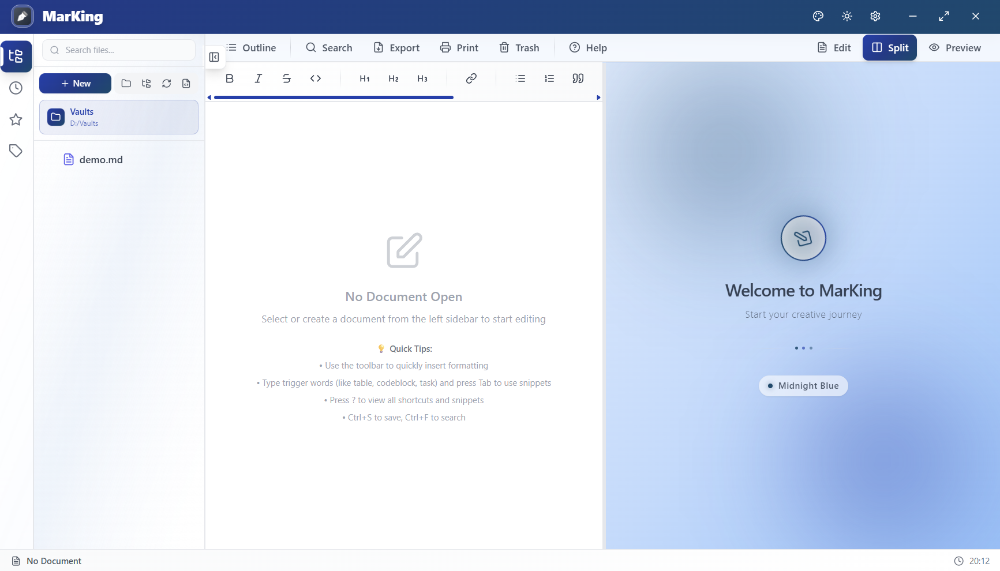

# MarKing - Professional Markdown Editor

English | [简体中文](./README.md)

**Be the King of Markdown** 👑

Modern cross-platform Markdown editor for efficient and professional document creation

[Download](#-download) • [Features](#-core-features) • [Documentation](docs/FAQ.md) • [Changelog](CHANGELOG.md) • [Feedback](https://github.com/l06066hb/MarKing/issues)

---

## 📸 Application Preview

---

## 📥 Download

> 💡 **Current Version**: v1.0.11 | **System Requirements**: Windows 10 (64-bit) or higher

### Windows

- **[MarKing_1.0.11_x64_en-US.msi](https://github.com/l06066hb/MarKing/releases/latest)** - MSI Installer
  - Automatic installation
  - Desktop shortcut creation
  - Silent installation support
- **[MarKing_1.0.11_x64-setup.exe](https://github.com/l06066hb/MarKing/releases/latest)** - NSIS Installer
  - User-friendly installation wizard
  - Complete system integration
  - Traditional installation experience

> **System Requirements**: Windows 10 (64-bit) or higher

### macOS (Coming Soon)

macOS version is under testing. Stay tuned.

### Linux (Coming Soon)

Linux version is under testing. Stay tuned.

---

## ✨ Core Features

### 📝 Professional Editing

- **Monaco Editor** - Same core as VS Code, professional-grade editing experience
- **Real-time Preview** - WYSIWYG Markdown rendering with bidirectional scroll sync
- **Smart Completion** - 67+ built-in code snippets, Tab to expand
- **Syntax Highlighting** - Support for multiple programming languages
- **One-click Formatting** - Shift+Alt+F to auto-format documents

### 🎯 Innovative Features

- **Visual Table Editor** - Edit Markdown tables like Excel
  - Auto-display when cursor enters table
  - Real-time bidirectional sync
  - Add/delete rows and columns, set alignment
  - Complete keyboard shortcut support (Tab/Enter/Esc)

- **Smart Paste** - Streamline your workflow
  - Screenshot paste: Ctrl+V auto-saves and inserts
  - File paste: Auto-processes copied image files
  - Text paste: Smart normalization

- **Auto List Continuation** - No more manual list symbols
  - Supports ordered lists, unordered lists, task lists
  - Auto-increment numbering, maintain indentation
  - Press Enter on empty item to exit

### 📦 Powerful Export

- **DOCX Professional Templates** - 10+ configuration options
  - 3 carefully designed preset templates (Technical, Business, General)
  - Unlimited custom templates
  - Complete cover, table of contents, header/footer support
  - Fine control of fonts, spacing, and styles

- **High-quality PDF Output** - Based on Pandoc engine
- **HTML Static Pages** - Complete style preservation, browser-ready

### 🎨 Beautiful & Easy to Use

- **12 Preview Themes** - From minimalist to stunning
  - Gradient, Glassmorphism, Cyberpunk, Minimalist
  - Nature, Ocean, Sunset, Forest, Desert
  - Arctic, Volcano, Galaxy
  
- **Light/Dark Mode** - Global theme switching, eye-friendly
- **Modern UI** - Material Design style, smooth animations
- **Elegant Scrollbars** - Refined interaction experience

### 🗄️ Smart Management

- **Multi-vault Support** - Independently manage different projects
- **Global Search** - Rust parallel processing, millisecond response
- **Auto-save** - 2-second debounce, never lose data
- **Version Snapshots** - Auto-save last 10 versions, restore anytime
- **Data Backup** - One-click backup and restore, ZIP compression

### 🌍 International Support

- **Complete Bilingual Interface** - Chinese/English one-click switching, covers all modules
- **Type-safe Translation** - TypeScript type checking ensures accuracy
- **Real-time Switching** - Instant language change, smooth experience

---

## 🎯 Use Cases

| Scenario | Application |
|----------|-------------|
| **Technical Documentation** | API docs, development manuals, tech blogs |
| **Academic Writing** | Papers, reports, notes (supports KaTeX formulas) |
| **Project Management** | Requirements docs, design docs, meeting minutes |
| **Knowledge Management** | Personal notes, knowledge base, learning materials |
| **Content Creation** | Blog articles, tutorials, e-books |

---

## 🚀 Quick Start

### 1. Install Application
Download the installer for your platform and follow the wizard

### 2. Create Document
Click the `+` button in toolbar or press `Ctrl+N`

### 3. Start Editing
- Type Markdown in left editor
- View real-time preview on right
- Use code snippets for quick content insertion

### 4. Export Document
Click "Export" button in toolbar, choose format (DOCX/PDF/HTML)

> 📚 **More Tips**: See [FAQ](docs/FAQ.md) and [Troubleshooting](docs/TROUBLESHOOTING.md)

---

## 💡 Why Choose MarKing?

### ⚡ Excellent Performance
- Startup time < 0.5 seconds
- Installer size ~40MB (includes complete Pandoc)
- Runtime memory ~30-40MB

### 🎨 Great Experience
- Modern interface design
- Smooth interactive animations
- Complete keyboard shortcut support (press `?` to view all)

### 🔒 Data Security
- Local storage, protect privacy
- Auto-save, prevent loss
- Version snapshots, restore anytime
- Data backup, peace of mind
- Complete logging for troubleshooting

---

## Common Shortcuts

| Operation | Windows/Linux | macOS |
|-----------|---------------|-------|
| New Document | `Ctrl+N` | `Cmd+N` |
| Save Document | `Ctrl+S` | `Cmd+S` |
| Global Search | `Ctrl+F` | `Cmd+F` |
| Format Document | `Shift+Alt+F` | `Shift+Option+F` |
| Table Editor | `Ctrl+Shift+T` | `Cmd+Shift+T` |
| Shortcut Help | `?` | `?` |

> Complete shortcut list: Press `?` in app

---

## 📄 Copyright

Copyright © 2024-2026 MarKing. All rights reserved.

This software is proprietary and protected by copyright law and international treaties. Unauthorized copying, modification, distribution, or reverse engineering is prohibited.

See [LICENSE](LICENSE) file for details.

### Disclaimer

MarKing is the name of this software. Unauthorized use for commercial purposes or implying official endorsement is prohibited.

---

## 🔗 Related Links

- 📥 [Download](https://github.com/l06066hb/MarKing/releases) - Get the latest version
- 🌐 [Official Website](https://markingmd.com) - Online experience and documentation
- 📝 [Changelog](CHANGELOG.md) - View version history
- 📚 [FAQ](docs/FAQ.md) - Usage tips and Q&A
- 🔧 [Troubleshooting](docs/TROUBLESHOOTING.md) - Solve common issues

---

## 📞 Get Help

We provide multiple support channels to help you solve problems:

- 🐛 **Issue Reporting** - [GitHub Issues](https://github.com/l06066hb/MarKing/issues)
  - Bug Report: [Submit Bug](https://github.com/l06066hb/MarKing/issues/new?template=bug_report.md)
  - Feature Request: [Submit Suggestion](https://github.com/l06066hb/MarKing/issues/new?template=feature_request.md)
  
- 💬 **Discussion** - [GitHub Discussions](https://github.com/l06066hb/MarKing/discussions)
  - Usage questions
  - Experience sharing
  
- 🔒 **Security Issues** - See [SECURITY.md](SECURITY.md)

- 📖 **Documentation**
  - [FAQ](docs/FAQ.md)
  - [Troubleshooting Guide](docs/TROUBLESHOOTING.md)

---

## 💖 Support the Project

If MarKing helps you, please consider sponsoring development. Your support drives continuous updates!

- ☕ **[Afdian](https://afdian.com/a/l06066hb)** - For Chinese users, supports WeChat/Alipay
- 🌍 **[Ko-fi](https://ko-fi.com/l06066hb)** - For international users, supports Credit Card/PayPal

> 💡 All sponsorships support project development and maintenance • Thank you to every supporter

---

**Be the King of Markdown!** 👑✍️

MarKing v1.0.11 | Making Document Creation More Efficient

[⬆️ Back to Top](#marking---professional-markdown-editor)

