

# MarKing

**Local-first · Zero tracking · Cross-platform — A Markdown editor for sustained writing**

English | [简体中文](./README.md)

 

`Web URL Import` · `Vault Overview` · `Scroll Sync Stability` · `Clipboard Quick Capture` · `Attachment Manager` · `Document Properties` · `WikiLink Backlinks` · `Knowledge Graph` · `Command Palette` · `Focus Mode` · `MathLive Formulas` · `Excalidraw` · `DOCX/PDF/HTML Export`

 

MarKing is a desktop Markdown editor focused on native performance and stability.  
**Local-first, zero tracking, ad-free** — your writing stays on your own device.

> **v1.4.0 — Web URL Import · Vault Overview · Scroll Sync Stability**: Paste any URL to save the page as a high-fidelity Markdown note, no browser extension required; a new Vault Overview panel surfaces note count, total words, categories, tags and recent edits at a glance; in long documents, asynchronous loading of Mermaid, Excalidraw and images no longer causes the preview to jump while scrolling.

 

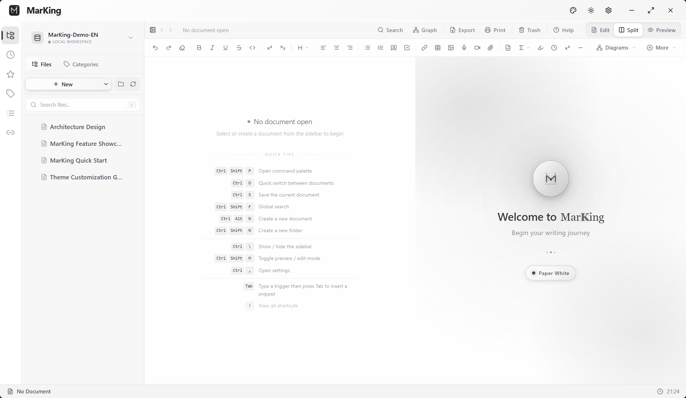

---

## Download & Install

Out-of-the-box desktop clients, natively compiled for every platform — no extra runtime required.

| Platform | Architecture | Installer |
|:---:|:---:|:---:|
| **Windows** | x64 | [EXE / MSI](https://github.com/l06066hb/MarKing/releases/latest) |
| **macOS** | Apple Silicon / Intel | [DMG](https://github.com/l06066hb/MarKing/releases/latest) |
| **Linux** | x64 / ARM64 | [AppImage / Deb / RPM](https://github.com/l06066hb/MarKing/releases/latest) |

> Head to the [Releases](https://github.com/l06066hb/MarKing/releases/latest) page and expand **Assets** for the latest installer for your platform.

---

## Why MarKing?

- **Truly local-first** — Plain `.md` files on your disk. No cloud lock-in, no proprietary formats, no telemetry
- **Native performance** — Natively compiled, < 2 s cold start, smooth scrolling through 100K-word docs
- **Knowledge management** — WikiLink backlinks + interactive knowledge graph turn isolated notes into a connected web
- **Immersive writing** — Focus Mode, Command Palette, Breadcrumb nav for a distraction-free writing environment
- **Professional content** — MathLive formulas, Excalidraw whiteboard, Mermaid diagrams — one-stop technical authoring
- **One-click export** — DOCX template engine v2.0 / PDF / HTML — from academic papers to business reports
- **Cross-platform** — Windows · macOS (Intel & Apple Silicon) · Linux, one consistent experience

---

## Core Features

### 1. Dual-Mode Performance Architecture

*   **Lightweight Mode**  
    Tailored for fast reading and light edits. With sidebars and extra components stripped away, double-click any `.md` file for an instant, ultra-low-memory launch.

    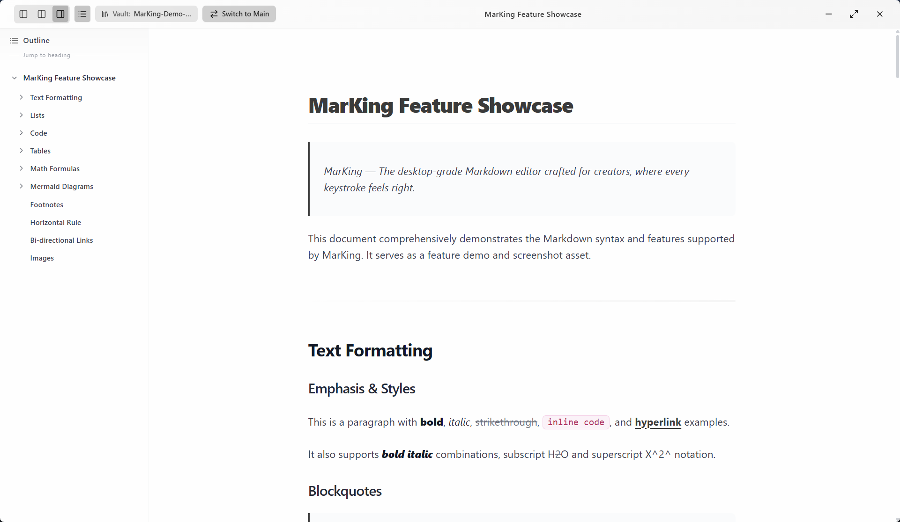

*   **Full-Featured Professional Editor**  
    Handles 100K+ word documents with smooth scrolling. Ships with 70+ Markdown smart snippets and contextual suggestions for a professional editing experience.

    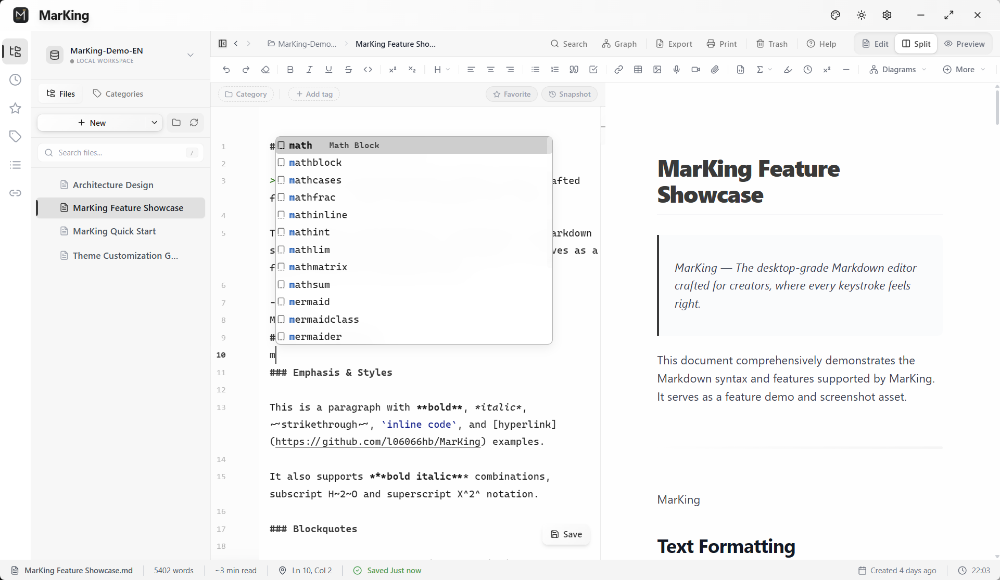

### 2. Knowledge Management & Productivity

*   **Bi-directional Links & Knowledge Graph** `NEW`  
    Full `[[WikiLink]]` backlink system paired with an interactive knowledge graph. Force-directed layout, zoom & pan, 10K+ node smooth interaction, graph export (PNG/SVG), and immersive fullscreen.

    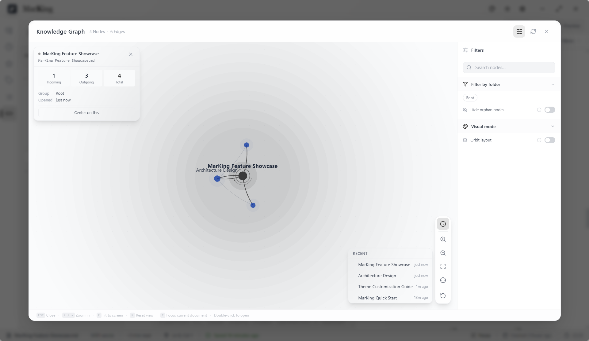

*   **Command Palette & Quick Switcher** `NEW`  
    `Ctrl+Shift+P` for a global command search panel; `Ctrl+P` for instant fuzzy file-name navigation. Breadcrumb bar above the editor shows the real-time directory path.

    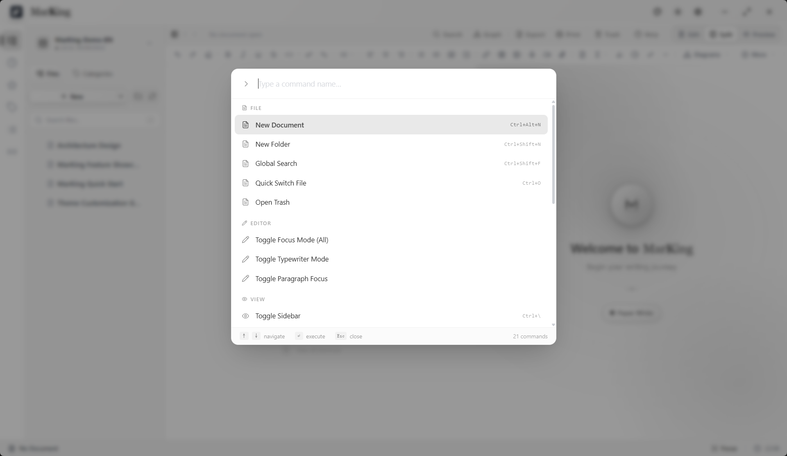

*   **Focus Mode** `NEW`  
    Typewriter Mode (current line always centered) + Highlight Mode (dims non-active paragraphs) for distraction-free immersive writing.

*   **Callout Blocks** `NEW`  
    Renders `> [!NOTE]`, `> [!WARNING]` and other admonition types in real-time, compatible with both GitHub Alerts and Obsidian Callout syntax.

### 3. Creation & Interaction

*   **MathLive Formula Editor**  
    Integrated WYSIWYG math formula editor supporting inline and block equations. Comes with a virtual math keyboard, fully offline rendering — no manual LaTeX needed.

    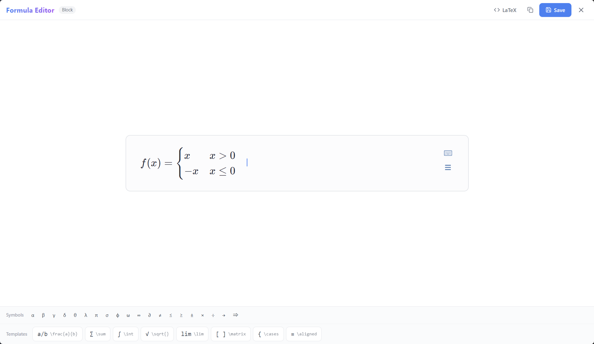

*   **Excalidraw Whiteboard** `NEW`  
    Embed freeform hand-drawn flowcharts, architecture sketches, and diagrams directly within your documents. A hand-drawn aesthetic that brings technical documentation to life.

    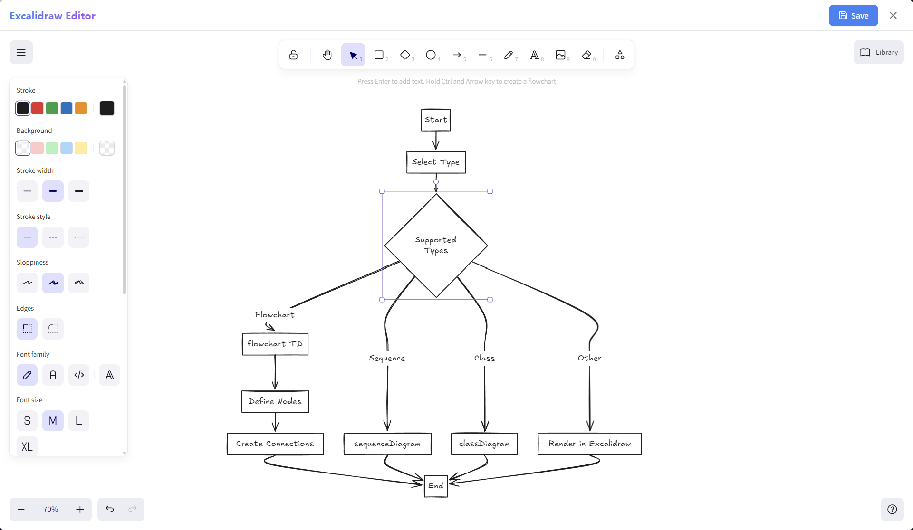

*   **Visual Table Editor**  
    A floating in-app editor for Markdown tables — no more manual character alignment. Supports Excel-like row/column drag, insert/delete, and content alignment.

    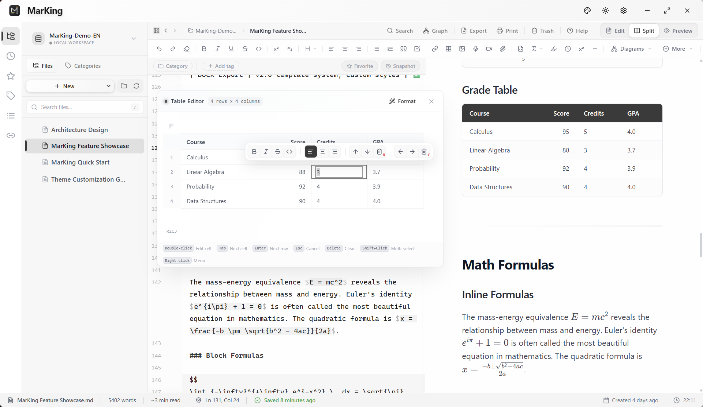

*   **Mermaid Diagram Assistant**  
    Built-in professional Mermaid rendering support. Flowcharts, sequence diagrams, and architecture diagrams — all with real-time syntax validation and live preview.

    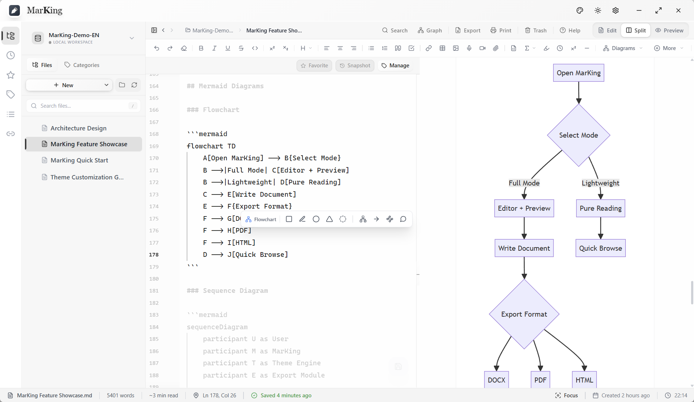

*   **Dual-Domain Themes & Code Highlighting**  
    12px borderless immersive interface. Beyond global light/dark themes, ships with multiple classic code block presets (Dracula, Nord, Tokyo Night, etc.) for the ultimate syntax highlighting experience.

    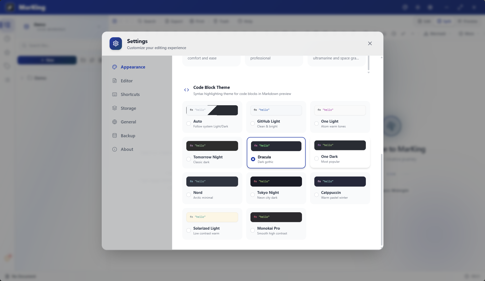

### 4. Safe & Reliable Local Data

*   **Multi-Vault Management**  
    Physically isolate different document vaults within the app. Personal journals and work documents remain completely independent with zero search interference.

    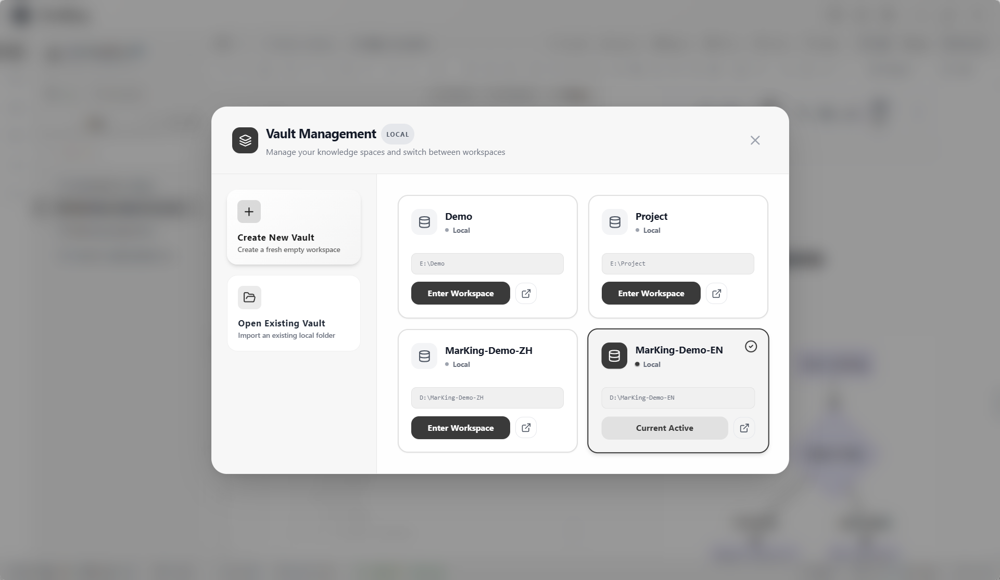

*   **Auto-Save & History Snapshots**  
    2-second silent auto-save + historical snapshot rollback, preventing data loss from accidental edits or power failures.

    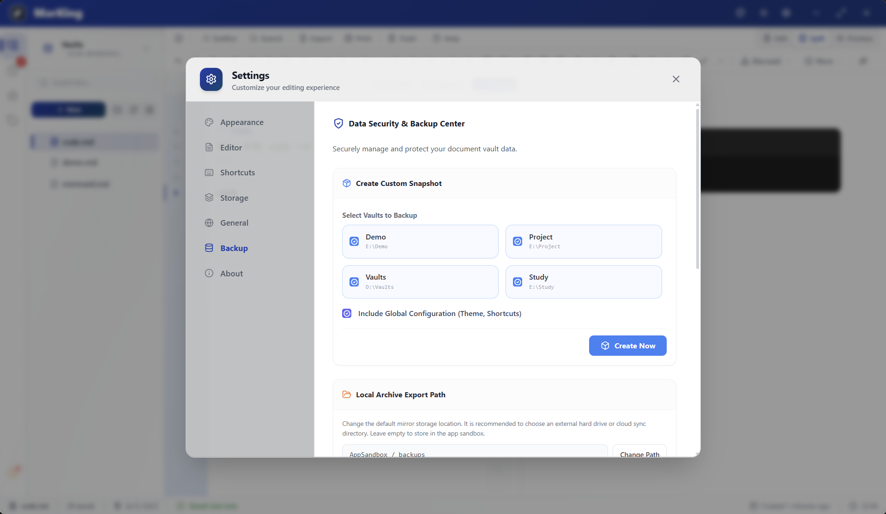

*   **Clipboard Image Storage**  
    `Ctrl+V` to paste screenshots — images are automatically saved to a local attachment directory with correct relative markdown references.

### 5. Professional Document Export

*   **DOCX Template Engine v2.0** `NEW`  
    Brand-new template-based export architecture with live layout preview, fine-grained font and spacing controls. Ships with multiple professional templates for one-click generation of formal reports with cover pages, TOC, and headers/footers.

    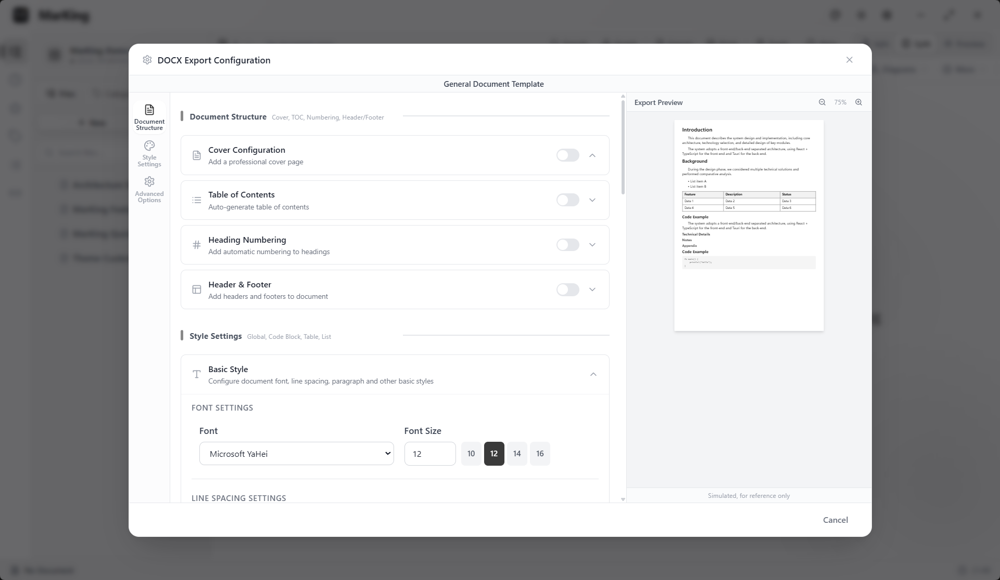

*   **PDF & HTML Export**  
    Export high-quality PDFs with bookmarked TOC, or render your document as a standalone HTML page for offline sharing.

    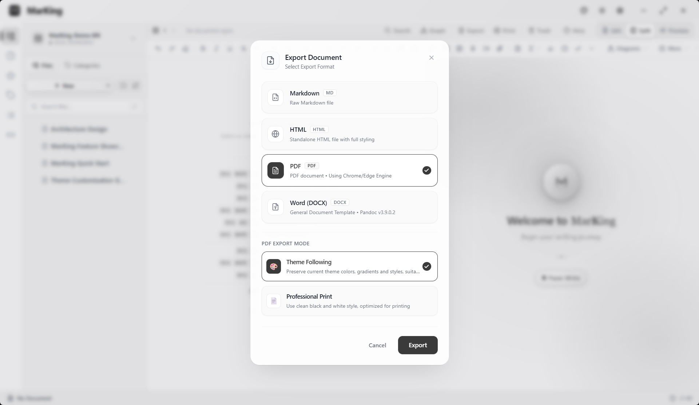

---

## Documentation

*   [FAQ & Usage Guide](docs/FAQ.md)
*   [Changelog & Version History](CHANGELOG_EN.md)
*   [Security Policy & Bug Reporting](SECURITY.md)

---

## Support This Project

**If MarKing has improved your writing workflow, please give it a Star**

It's the most direct encouragement for an independent developer — and helps others discover this tool.

### Sponsorship

Sustaining a purely local-first, zero-tracking, ad-free cross-platform app is no small feat.  
If you value MarKing's quality, consider becoming an early sponsor:

*   **Global** — [Ko-fi](https://ko-fi.com/l06066hb) (Visa / PayPal)
*   **China** — [Afdian](https://afdian.com/a/l06066hb) (WeChat / Alipay)

---

*Copyright © 2025-2026 MarKing. All rights reserved.*
